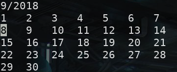

# Halendar

## NB. At the moment this is in a highly extreme experimental state.

An interactive command line calendar.



## Commands

```
ESC  - quit
q    - quit
wasd - move around on the calendar
r    - reset focused day back to current day
```

## TODO

- Lots of things.
